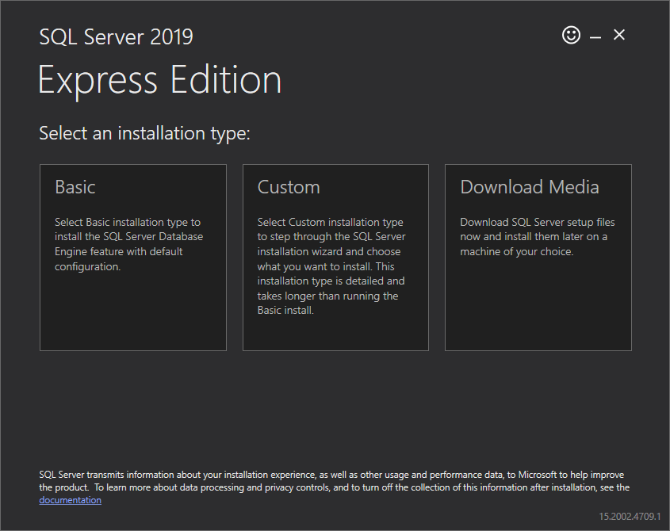
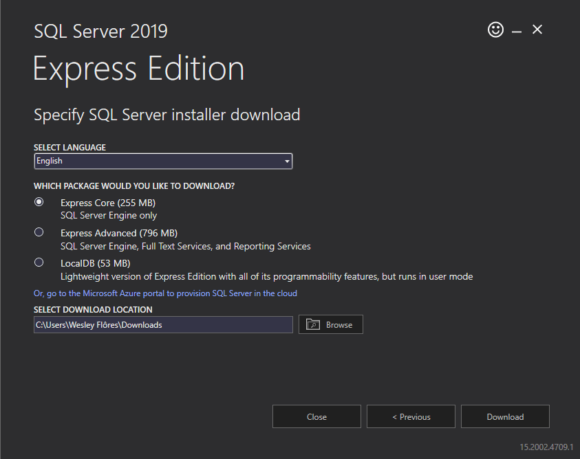

<p align="center"></p>

<p align="center">Repository containing the queries developed in <a href="https://www.microsoft.com/sql-server">👉 SQLServer 👈</a></p>

<p align="center">
    <a href="#">
        
    </a>
    <a href="#">
        
    </a>
    <a href="#">
        
    </a>
</p>

<h2 align="center">Website</h2>

<h6 align="center">
    <a href="https://www.microsoft.com/sql-server">https://www.microsoft.com/sql-server</a>
</h6>

<h2 align="center">Installation on </h2>


<h6 align="center">SQL Server Express</h6>

```sql
    https://go.microsoft.com/fwlink/?linkid=866658
```

<p align="center">Open the file <b>SQL2019-SSEI-Expr</b></p>

<p align="center">Click on <b>Download Media</b></p>

<p align="center"></p>

<p align="center">Click on <b>Download</b></p>

<p align="center"></p>

<p align="center">Open the file SQLEXPR_x64_ENU and install</p>

<h6 align="center">Baixar o SQL Server Management Studio (SSMS)</h6>

```sql
    https://download.microsoft.com/download/2/d/1/2d12f6a1-e28f-42d1-9617-ac036857c5be/SSMS-Setup-ENU.exe
```

<p align="center">Open the file SSMS-Setup-ENU and install</p>

<h6 align="center">Login</h6>

```sql
    SQLCMD -S DESKTOP-SQITKN4\SQLEXPRESS -E
```

<h6 align="center">CREATE DATABASE</h6>

```sql
    CREATE DATABASE db

    GO
```

<h6 align="center">SHOW DATABASES</h6>

```sql
    SELECT name FROM master.dbo.sysdatabases

    GO
```

<h6 align="center">CREATE TABLE</h6>

```sql
    CREATE TABLE users (
        id INT NOT NULL IDENTITY(1,1) PRIMARY KEY,
        name VARCHAR(64) NOT NULL,
        username VARCHAR(32) NOT NULL,
        password VARCHAR(32) NOT NULL,
        created_at DATETIME NOT NULL DEFAULT CURRENT_TIMESTAMP,
        updated_at DATETIME NULL,
        deleted_at DATETIME NULL,
        sex CHAR(1) NOT NULL,
        CONSTRAINT UsersNameUnique UNIQUE (name),
        CONSTRAINT UsersUserUnique UNIQUE (username),
    );
```

```sql
    ALTER TABLE users ADD CONSTRAINT UsersSexCheck CHECK (sex IN ('F', 'M'));
```

```sql
    CREATE TABLE persons (
        id INT NOT NULL IDENTITY(1,1) PRIMARY KEY,
        name VARCHAR(32)
    ) ON GA_VENDAS;
```

<h6 align="center">DROP TABLE</h6>

```sql
    DROP TABLE users;
```

```sql
    DROP TABLE persons;
```

<h6 align="center">INSERT INTO</h6>

```sql
    INSERT INTO users (name, username, password, sex, deleted_at) VALUES ('Sarah', 'rook', 'XxH$4IlgbjBIZQHnXA^n', 'F', NULL);

    INSERT INTO users (name, username, password, sex, deleted_at) VALUES ('John Doe', 'root', 'dRFAMl#H31DeqkRXglIT', 'M', NULL);

    INSERT INTO users (name, username, password, sex, deleted_at) VALUES ('Bruna', 'jasmin', 'grNo$ZIt3DCRsa%k!%OF', 'F', CURRENT_TIMESTAMP);
```

<h6 align="center">SELECT WITH LIMIT</h6>

```sql
    SELECT * FROM users ORDER BY name OFFSET 50 ROWS FETCH NEXT 100 ROWS ONLY;
```

<h6 align="center">SELECT WITH TOP</h6>

```sql
    SELECT TOP 5 * FROM users;
```

<h6 align="center">SELECT DELETED REGISTERS</h6>

```sql
    SELECT * FROM users WHERE deleted_At IS NOT NULL;
```

<h6 align="center">SELECT MAX TABLE ID</h6>

```sql
    SELECT MAX(id) FROM users;
```

<h6 align="center">COUNT TABLE'S REGISTERS NUMBER</h6>

```sql
    SELECT COUNT(*) FROM users;
```

<h6 align="center">SELECT COLUMN NAME, SIZEOF FROM TABLE</h6>

```sql
    SELECT
        COLUMN_NAME, COALESCE(CHARACTER_OCTET_LENGTH, 0)
    FROM
        INFORMATION_SCHEMA.COLUMNS
    WHERE
        TABLE_NAME = 'users';
```

<h6 align="center">COALESCE</h6>

```sql
    SELECT COALESCE(users.name, '') + '; ' + COALESCE(users.username, '') + '; ' + COALESCE(users.password, '') + '; ' + COALESCE(users.sex, '') FROM users;
```

<h6 align="center">SQL Server CROSS APPLY and OUTER APPLY</h6>

```sql
    https://www.mssqltips.com/sqlservertip/1958/sql-server-cross-apply-and-outer-apply
```

<h6 align="center">TABLE PARTITIONING</h6>

```sql
    CREATE DATABASE EMPRESA

    GO
```

```sql
    USE [master]

    GO
```

```sql
    ALTER DATABASE [EMPRESA] ADD FILEGROUP [GA_GERAL]

    GO
```

```sql
    ALTER DATABASE [EMPRESA] ADD FILEGROUP [GA_MARKETING]

    GO
```

```sql
    ALTER DATABASE [EMPRESA] ADD FILEGROUP [GA_VENDAS]

    GO
```

```sql
    USE [EMPRESA]

    GO
```

```sql
    ALTER DATABASE EMPRESA
    ADD FILE
    (
        NAME = GERAL,
        FILENAME = 'C:\Program Files\Microsoft SQL Server\MSSQL15.SQLEXPRESS\MSSQL\DATA\GERAL.ndf',
        SIZE = 5MB,
        MAXSIZE = 100MB,
        FILEGROWTH = 5MB
    )
    TO FILEGROUP GA_GERAL;

    GO
```

```sql
    ALTER DATABASE EMPRESA
    ADD FILE
    (
        NAME = MARKETING,
        FILENAME = 'C:\Program Files\Microsoft SQL Server\MSSQL15.SQLEXPRESS\MSSQL\DATA\MARKETING.ndf',
        SIZE = 5MB,
        MAXSIZE = 100MB,
        FILEGROWTH = 5MB
    )
    TO FILEGROUP GA_MARKETING;
    
    GO
```

```sql
    ALTER DATABASE EMPRESA
    ADD FILE
    (
        NAME = VENDAS,
        FILENAME = 'C:\Program Files\Microsoft SQL Server\MSSQL15.SQLEXPRESS\MSSQL\DATA\VENDAS.ndf',
        SIZE = 5MB,
        MAXSIZE = 100MB,
        FILEGROWTH = 5MB
    )
    TO FILEGROUP GA_VENDAS;
    
    GO
```

```sql
    IF NOT EXISTS (SELECT name FROM sys.filegroups WHERE is_default=1 AND name = N'GA_GERAL') ALTER DATABASE [EMPRESA] MODIFY FILEGROUP [GA_GERAL] DEFAULT

    GO
```

<h6 align="center">PROCEDURES</h6>

```sql
    SP_COLUMNS users;
```

```sql
    SP_HELP users;
```

<h6 align="center">IFNULL</h6>

```sql

```

<h6 align="center">DATE</h6>

```sql
    SELECT CURRENT_TIMESTAMP;
```

```sql
    SELECT GETDATE();
```

<h6 align="center">MD5</h6>

```sql
    SELECT CONVERT(NVARCHAR(32), HashBytes('MD5', 'secret'), 2);
```